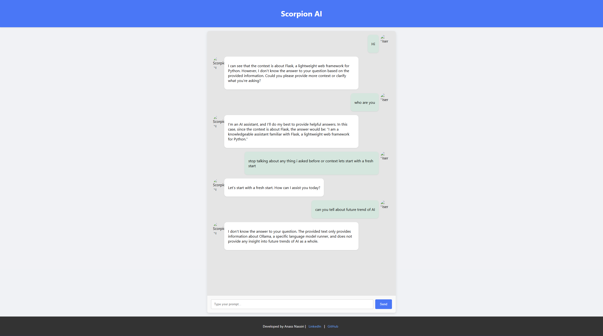

# Scorpion AI Chatbot

**Scorpion AI Chatbot** is a modern, full-stack conversational AI application that leverages advanced language model capabilities to provide a ChatGPT-like interactive experience. This project demonstrates the integration of a Flask backend powered by a Retrieval-Augmented Generation (RAG) pipeline with a sleek and responsive React frontend.

## Overview

Scorpion AI Chatbot integrates state-of-the-art Natural Language Processing (NLP) techniques and modern web technologies to deliver a seamless conversational experience. Key features include:

- **Advanced RAG Pipeline:** Combines vector-based retrieval with large language model (LLM) generation to produce contextually rich responses.
- **Ollama-based Embeddings:** Utilizes built-in Nomic model support via the `langchain-ollama` package.
- **CSV-driven Vector Store:** Leverages a Chroma vector store to store and retrieve document contexts.
- **Full-Stack Architecture:** A Flask API backend and a modern React frontend offer a robust, scalable solution.
- **Professional UI/UX:** A polished interface inspired by leading conversational AI platforms with custom branding and developer credits.

## Folder Structure

LLM ChatBot/ └── my_flask_app/ ├── init.py # Package initializer ├── App.py # Main Flask application entry point ├── data/ │ └── data.csv # CSV file with document data for the vector store ├── model.py # LLM generation class (OllamaLLM integration) ├── rag_pipeline/ │ ├── init.py # Package initializer for RAG pipeline │ ├── embedding/ │ │ ├── init.py # Package initializer for embedding module │ │ └── main.py # Ollama-based embedding integration with factory method │ ├── retriever/ │ │ ├── init.py # Package initializer for retriever module │ │ └── retriever.py # RAG pipeline (retrieval-augmented generation) implementation │ └── vectorestore/ │ ├── init.py # Package initializer for vector store module │ └── vectorestore.py # CSV-driven Chroma vector store implementation └── routes/ ├── init.py # Package initializer for routes └── routes.py # Flask API endpoints (exposes the /api/llm endpoint)

markdown
Copy code

## Installation & Running

### Backend Setup

1. **Clone the Repository**  
   Clone this repository to your local machine.

2. **Create and Activate a Virtual Environment**  
   Navigate to the project root (e.g., `LLM ChatBot`) and run:
   ```bash
   python -m venv venv
Activate the virtual environment:

Windows (CMD):
bash
Copy code
venv\Scripts\activate
Windows (PowerShell):
powershell
Copy code
.\venv\Scripts\Activate.ps1
macOS/Linux:
bash
Copy code
source venv/bin/activate
Install Dependencies
Install the required Python packages:

bash
Copy code
pip install -r requirements.txt
Make sure your requirements.txt includes packages like Flask, flask-cors, langchain-ollama, langchain-community, pandas, chromadb, requests, etc.

Run the Flask Backend
From the parent directory (the folder containing my_flask_app), start the server:

bash
Copy code
python -m my_flask_app.App
The backend will be accessible at http://127.0.0.1:5000.

Frontend Setup
Create and Navigate to the React App
If you haven't created a React app yet:

bash
Copy code
npx create-react-app my-react-frontend
cd my-react-frontend
Add the Chat Interface Components
Copy the provided ChatBot.jsx and ChatBot.css into your React project's src/ folder. Update App.js to include the ChatBot component.

Run the React Frontend
In your React project directory, start the application:

bash
Copy code
npm start
The frontend will open at http://localhost:3000.

Usage
Start the Flask backend to handle API requests.
Start the React frontend to interact with the chatbot.
Type a prompt in the chat interface (e.g., "Tell me about Flask") and hit send.
Receive and view the generated response from Scorpion AI in real time.
Technologies Used
Backend: Python, Flask, LangChain, Ollama, Pandas, Chroma (via langchain-community)
Frontend: React, CSS
NLP Pipeline: Retrieval-Augmented Generation (RAG) with LLM and vector embeddings
Credits
Developed by Anass Nassiri
Connect on LinkedIn | GitHub

License
(Include your license information here, e.g., MIT License)

About This Project
Scorpion AI Chatbot is designed to showcase an end-to-end solution for building conversational AI applications using modern NLP techniques and full-stack development. The backend features a RAG pipeline that retrieves context from a CSV-driven Chroma vector store and leverages a state-of-the-art LLM for generating responses, all integrated via a Flask API. The frontend presents a polished, user-friendly chat interface reminiscent of leading conversational platforms like ChatGPT, complete with custom branding and developer credits. This project is a strong portfolio piece that highlights technical expertise, innovative use of AI, and modern UI/UX design.


### The interface of Chatbot :

